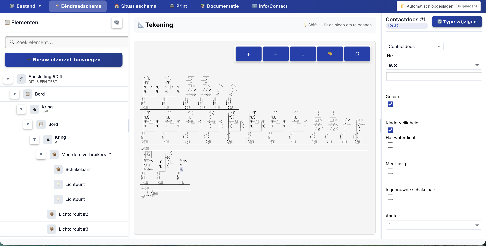

# Eendraadschema

> Design and draw one-wire electrical diagrams for Belgian AREI legislation — entirely in the browser

[](https://github.com/TimVanOnckelen/eendraadschema/actions/workflows/build.yml)
[](https://react.dev/)
[](https://www.typescriptlang.org/)
[](https://vitejs.dev/)
[](LICENSE.md)
[](package.json)



## Live Demo

Try the application online: **[https://eendraadschema.xeweb.be](https://eendraadschema.xeweb.be)**

## Table of Contents

- [About](#about)
- [Features](#features)
- [Getting Started](#getting-started)
- [Technical Stack](#technical-stack)
- [Versioning](#versioning)
- [Contributing](#contributing)
- [License](#license)
- [Acknowledgments](#acknowledgments)

## About

Eendraadschema is a browser-based tool for designing one-wire electrical diagrams as required by the **Belgian AREI legislation**. No installation, no server — open the app and start drawing.

## Features

### User Interface

- Modern React 19 component architecture
- Ribbon-based interface with compact button layouts
- Dark mode support
- Responsive design with flexbox layouts

### Schema Editor

- Full React implementation of the electrical schema editor
- All original electrical schema functionality preserved
- Improved rendering performance
- Interactive SVG diagrams

### Situation Plan (Situatieschema)

- Searchable SVG symbol library
- Filter symbols by category
- Drag-and-drop placement of electrical symbols
- Element selection and positioning tools
- Multi-page management
- Zoom controls (25%, 50%, 75%, 100%, 150%, 200%)

### File Management

- Auto-save every 5 seconds
- IndexedDB-based local storage
- Recovery dialog for unsaved changes
- Visual save status indicator
- Import/export `.eds` and `.json` files
- PDF export functionality

### Documentation

- Integrated documentation viewer
- PDF manuals included

## Getting Started

### Prerequisites

- Node.js 18 or higher
- npm or yarn

### Installation

```bash
# Clone the repository
git clone https://github.com/TimVanOnckelen/eendraadschema.git
cd eendraadschema

# Install dependencies
npm install

# Start development server
npm run dev
```

The application opens at `http://localhost:5173`.

### Building for Production

```bash
npm run build
```

Output is placed in the `dist/` folder.

## Technical Stack

| Tool | Purpose |
|---|---|
| React 19 | UI framework |
| TypeScript 5.8 | Type-safe development |
| Vite 6 | Build tool and dev server |
| IndexedDB | Client-side storage |
| jsPDF 4 | PDF generation |
| pako | Compression |

## Versioning

This project uses **[Semantic Versioning](https://semver.org/)** (`MAJOR.MINOR.PATCH`) driven automatically by [semantic-release](https://semantic-release.gitbook.io/semantic-release/). Releases are created when commits land on `master` — no manual version bumps needed.

The version bump is determined by commit message prefixes:

| Prefix | Example | Result |
|---|---|---|
| `fix:` | `fix: correct voltage label on diagram` | Patch (`1.0.1`) |
| `feat:` | `feat: add zoom to fit button` | Minor (`1.1.0`) |
| `feat!:` or `BREAKING CHANGE:` | `feat!: redesign file format` | Major (`2.0.0`) |

Prefixes like `docs:`, `chore:`, `refactor:`, `style:`, and `test:` do not trigger a release.

## Contributing

Contributions are welcome! Please follow these steps:

1. Open an issue first for any non-trivial change to align on the approach
2. Fork the repository and create a branch from `master`
3. Name your branch descriptively: `feat/zoom-to-fit`, `fix/pdf-export-crash`, etc.
4. Write commits using the [Conventional Commits](https://www.conventionalcommits.org/) format — this is required for the automated release pipeline to work correctly (see [Versioning](#versioning))
5. Open a Pull Request against `master` with a clear description of what changed and why

**Guidelines:**
- Keep pull requests focused — one feature or fix per PR
- Follow the existing TypeScript conventions and component structure
- Test your changes in the browser before opening a PR; CI only verifies the build passes

For contributions to the original vanilla TypeScript version, see [igoethal/eendraadschema](https://github.com/igoethal/eendraadschema).

## Recommended GitHub Setup

To get the most out of this project's automated workflows, the following GitHub configuration is recommended:

**Branch protection on `master`:**
- Require pull request reviews before merging
- Require the **Build Check** status check to pass
- Do not allow direct pushes — all changes go through PRs

**Issue & PR templates** (`.github/` folder):
- A bug report template that asks for steps to reproduce, expected vs actual behaviour, and browser/OS info
- A feature request template asking for the use case and proposed solution
- A pull request template with a checklist: description of the change, tested in browser, commits follow Conventional Commits

**Labels** for triage:
- `bug`, `enhancement`, `documentation`, `good first issue`, `breaking change`

**Secrets:**
- `GITHUB_TOKEN` is provided automatically — no extra secret is needed for semantic-release to publish releases and create changelogs

## License

Licensed under the GNU General Public License v3.0 — see [LICENSE.md](LICENSE.md) for details.

**Copyright:**

- Original eendraadschema: © Ivan Goethals
- This version: © Tim Van Onckelen

## Acknowledgments

This project would not exist without **[Ivan Goethals](https://github.com/igoethal)**, who designed and built the original eendraadschema application. The electrical schema logic, symbol library, and AREI compliance rules all originate from his work.

The original application is available at [igoethal/eendraadschema](https://github.com/igoethal/eendraadschema).

## Support

- [Report bugs](https://github.com/TimVanOnckelen/eendraadschema/issues)
- [Request features](https://github.com/TimVanOnckelen/eendraadschema/issues)
- Questions? Open an issue or start a discussion

